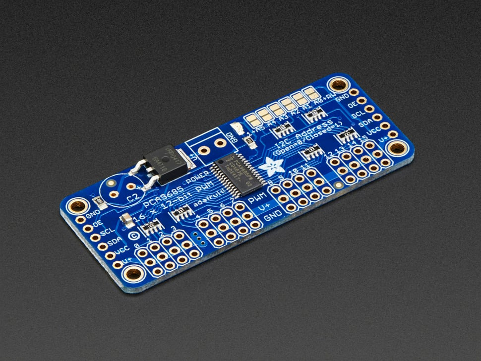
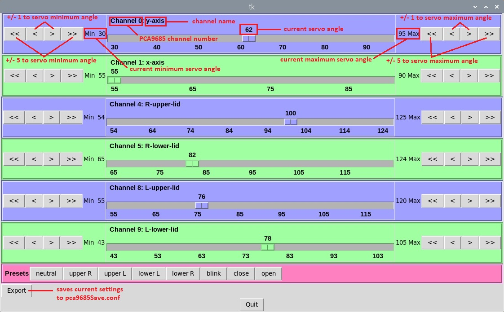

# Servo Controller

This repository contains a Python application used to calibrate the positions of a set of servos 
connected to an Adafruit 16-channel PCA9685 servo driver attached via I2C to a Raspberry Pi.  
It presents a Tkinter graphical interface with sliders for each servo allowing the user to adjust 
the current position, minimum position, and maximum position of each servo.  Using a JSON 
configuration file, each servo can be named and its initial minimum and maximum angles set.  A 
second JSON configuration file allows groups of settings (actions) to be defined and executed via 
preset buttons.

## Setup

(NOTE: These instructions are for installation on a Raspberry Pi 3 running the Buster OS.  
Instructions for installing, particularly libraries, may be different for the Bullseye OS.)

* Install the I2C libraries and tools as follows.

sudo apt-get install python-smbus python3-smbus python-dev python3-dev i2c-tools

* Make sure the I2C interface is enabled on the Raspberry Pi using raspi-config.

* Connect the servos to the servo driver, noting the channel numbers marked on the board for each 
servo (see below).  WARNING: Never connect or disconnect servos to the servo driver while power 
is applied, as this may damage the driver.

* Edit the pca9685.conf configuration file according to your particular setup for each servo, 
setting the channel number, name of the channel, initial angle, minimum angle, and maximum 
angle.  For each servo I recommend setting the initial angle to 90.0 degrees, minimum angle to 
70.0 degrees, and maximum angle to 110.0 degrees.  These will be adjusted further as you run the 
program.  If you are not familiar with JSON file format, it is recommended that you check your 
edits using this online tool: [JSON Lint](https://jsonlint.com/).

* Connect the driver to the Raspberry Pi I2C interface.

* Apply power to the servo driver.

* Confirm the I2C connection to the servo driver by running

sudo i2cdetect -y 1

You should see a table of I2C addresses with the 0x40 address filled in.

* Run the application as follows.

python3 controlpanel.py

## Usage

With the graphical interface (see below), you can instantly control the angle of each servo 
using the slider for the given servo.  Either click and drag the slider to the desired angle, 
or click to the right or left of the slider button to increment or decrement the angle in 
one-degree steps.  The minimum and maximum angle limits of the slider can be increased or 
decreased using the buttons at each end of the slider.

Depending on your project, you may want to set the initial servo positions to 90 degrees and 
then positioning the associated mechanical part of your project at the approximate midpoint 
of its range of motion before attaching it to the servo.  Then you can experiment with the 
position of each servo to find the servo angles corresponding to limits of the ranges of 
motion.  After all limits have been determined, the settings can be saved as a new servo 
configuration file named pca9685Save.conf by clicking the Export button.  If you later want 
to use this configuration in a subsequent run, you can rename it to pca9685.conf so that 
the application will apply this configuration when launched.

## Presets

The presets.conf JSON configuration file allows you to specify named groups of servo settings 
as "actions" so that you can click on the named preset button and have all servos go to those 
configured positions at once. If multiple actions are provided, then they are executed 
sequentially.